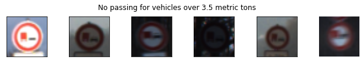
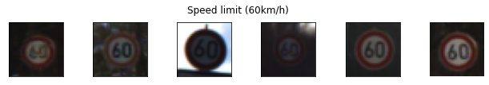
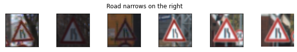
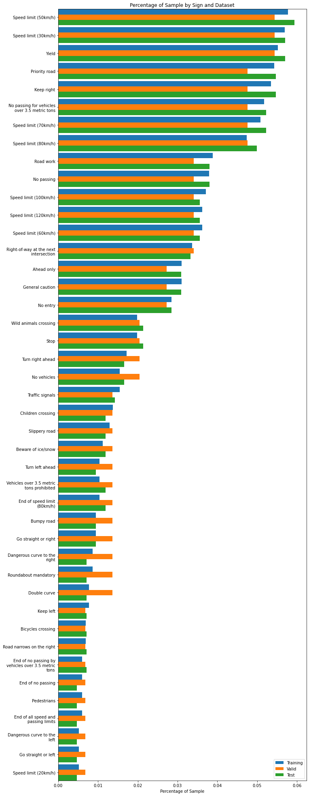
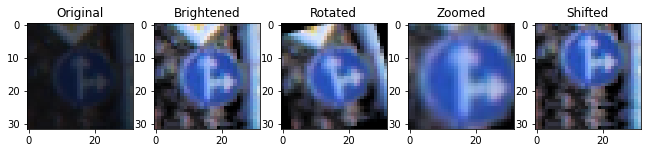
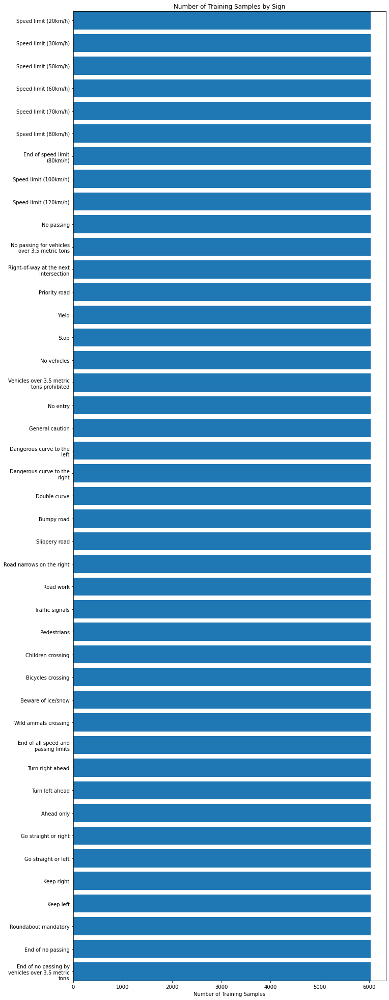

7-FEB-2021
# Traffic Sign Recognition
Implement a convolutional neural network that recognizes traffic signs.

## Goals
- Explore, summarize, and visualize traffic sign data
- Design, train and test a model architecture
- Use the model to make predictions on new images
- Analyze the softmax probabilities of the new images
- Experiment with a Multi-Scale CNN


## Traffic Sign Data

The traffic signs are contained in the `data` folder, contained in `train.p`, `valid.p`, and `test.p`. The file `signnames.csv` mapped the class ID number to the name of the type of sign. 

### Data Summary

Loading and examining the data yielded the following characteristics:

- Training Samples: 34,799
- Testing Samples: 12,630
- Image Shape: 32x32x3
- Number of types of Signs: 43


### Data Visualization

Below are images of just 3 of the 43 types of traffic signs. Some images are really dark and will need brightness adjusted. Wikipedia shows there are actually more than the 43 types of signs in this dataset. Color, shape, and orientation appear to matter for these traffic signs.





A larger sample showing images from all 43 types can be found in the [project html file](./Traffic_Sign_Classifier.html) under the section "Explore Some Traffic Signs".


### Sign Type Proportionality

On examining the percentage of each type of sign found in each dataset (below), over half the signs appear to have signficantly less than other signs. For example, the proportion of "Beware of Ice and snow" is much less than "Speed limit (50km/h)". Additional signs will be generated to address this disproportion so the model has a better chance to be equally exposed to all types of signs during training.




## The Model

### Preprocessing

The datasets are groomed to help in improve training. It was discovered during data exploration that many images were too dark, there was a disproportion accross the types traffic signs, and the images were in RGB format where each channel was a value beteen 0 and 255. Preprocessing required brightening, fake image generation, and normalization to address these issues.

#### Brightening Dark Images

`equalizeHist()` from `opencv` was used to brighten dark images:

```python
def equalizeHist(orgimg, v_thresh=128):
    '''
    Brightens dark images.
    
    Params:
    - orgimg: original image (RGB)
    - v_thresh: max integer of the average value of the image for brightening to occur
    '''
    hsv = cv2.cvtColor(orgimg, cv2.COLOR_RGB2HSV)
    mean_v = np.mean(hsv[:,:,2])
    if mean_v < v_thresh:
        equ = cv2.equalizeHist(hsv[:,:,2])
        hsv[:,:,2] = equ
        img = cv2.cvtColor(hsv, cv2.COLOR_HSV2RGB)
    else:
        img = orgimg
    return img
```


#### Generating Fake Images

Similar to Sermanet and Lecun in _"Traffic Sign Recognition with Multi-Scale Convolutional Networks"_, shifting, rotation, and scaling (zooming in) is randomly perfomed on traffic signs generated to augment the dataset. These manipulations will expose the model to different variations during training.

```python
def shift(image, d=None):
    '''
    Shifts image left, right, up or down from 1 to 6 pixels. 
    Used in generating additional training samples.
    '''
    if d is None:
        d = random.randint(1, 6)
    direction = random.choice([1, 2, 3, 4])
    if direction == 1:
        image[:-d] = image[d:]
    elif direction == 2:
        image[d:] = image[:-d]
    elif direction == 3:
        image[:,d:] = image[:,:-d]
    else:
        image[:,:-d] = image[:,d:]
        
    return image

def crop(image, size=32):
    '''
    Crops image to 32x32. Used after image is zoomed in.
    '''
    sizes = np.array(image.shape[:2]) - 32
    lower =  sizes // 2
    upper = image.shape[:2] - (lower + (sizes % 2))
    img = image[lower[0]:upper[0], lower[1]:upper[1]]
    return img

def zoom(image, scale=None):
    '''
    Zooms in on an image from 1.0x to 1.6x. Uses crop to ensure img is 32x32
    Used in generating additional training samples.
    '''
    if scale is None:
        scale = random.uniform(1.0, 1.6)
    img = sk.transform.rescale(image, scale, multichannel=True, preserve_range=True).astype(np.uint8)
    return crop(img)

def rotate (image, deg=None):
    '''
    Rotates image from -15 to 15 degrees.
    Used in generating additional training samples.
    '''
    if deg is None:
        deg = random.uniform(-15, 15)
    return sk.transform.rotate(image, deg, preserve_range=True).astype(np.uint8)
```

Below shows the effects of applying the above functions:



After adding the fake images, the training set grew from 34,799 to 259,290 samples that the model can use. The figure below shows that there is an equal proportion of traffic sign types in the training set.



#### Normalizing Image Data

"A guiding principle in developing the model architecture is for the inputs to have a mean of 0.0 (zero) and have equal variance" (see [Normalized Inputs and Initialization](https://youtu.be/WaHQ9-UXIIg?t=22). This makes it easier for the  the tensorflow optimizer to discover appropriate parameters (weights and biases) during training. The `function RGB_to_norm()` is applied to normalize the images:

```python
def RGB_to_norm(img):
    return (np.float32(img) - 128)/128
```

### Model Architecture

The model architecture generally follows the LeNet architecture outlined in _Lesson 13: Convolutional Neural Networks, Item 36. Lab: LeNet in Tensorflow_.

A 1x1 convolution used in the very first layer has an output shape of 32x32x1. This forces the model to compress the 3 RGB channels of the Input layer into 1 channel, thus achieving a grayscaling effect, but allowing the model to determine the significance of each channel value. The improved validation accuracy was quite astonishing as compared to training the model without this 1x1 convolution in the first layer. 

The other convolutional layers have the same first and second dimensions as LeNet, but are deeper (24 and 64 respectively. The fully connected layers are wider with dropout added in the later stages. The dropout also seemed to improve validation accuracy during experimentation as they are design the prevent overfitting.

A custom set of high level classes (`Layers1`, `Conv2D`, `Pooling`, `Flatten`, `Connected`, `Dropout`, `Model`, `Sequential`) which wrap `tensorflow` are used to help code the model in a Keras-like fashion.

```python
notLenet = Sequential("notLeNet", input_shape=image_shape, n_classes=n_classes)

notLenet.addLayer (Conv2D   ([32, 32, 1]))
notLenet.addLayer (Conv2D   ([28, 28, 24]))
notLenet.addLayer (Pooling  ([14, 14]))
notLenet.addLayer (Conv2D   ([10, 10, 64]))
notLenet.addLayer (Pooling  ([5, 5]))
notLenet.addLayer (Flatten  ())
notLenet.addLayer (Connected([240]))
notLenet.addLayer (Dropout  ())    
notLenet.addLayer (Connected([168]))
notLenet.addLayer (Dropout  ())

notLenet.assemble()
```

The model summary verified the output shapes of each layer of the model:
```
Model-6472 |      Summary for notLeNet:
Model-6472 | ----------------------------------
Model-6472 |      Input     :(?, 32, 32, 3)
Model-6472 | ----------------------------------
Model-6472 | 0  : Conv2D    :(?, 32, 32, 1)
Model-6472 | 1  : Conv2D    :(?, 28, 28, 24)
Model-6472 | 2  : Pooling   :(?, 14, 14, 24)
Model-6472 | 3  : Conv2D    :(?, 10, 10, 64)
Model-6472 | 4  : Pooling   :(?, 5, 5, 64)
Model-6472 | 5  : Flatten   :(?, 1600)
Model-6472 | 6  : Connected :(?, 240)
Model-6472 | 7  : Dropout   :(?, 240)
Model-6472 | 8  : Connected :(?, 168)
Model-6472 | 9  : Dropout   :(?, 168)
Model-6472 | ----------------------------------
Model-6472 |      Logits    :(?, 43)
Model-6472 | ----------------------------------
```

### Training

Tensorflow's `tf.nn.softmax_cross_entropy_with_logits` was used to caculate the losses for each training batch. The mean of this loss was fed to `tf.train.AdamOptimizer` minimize this during training.

```python
def connectLogits(self, prev_layer):

    self.logits = connected(prev_layer.tensor, [self.n_classes], activation=None)

    oh_labels      = tf.one_hot(self.y, self.n_classes)
    losses         = tf.nn.softmax_cross_entropy_with_logits(labels=oh_labels, logits=self.logits)
    self.mean_loss = tf.reduce_mean(losses)
    
    ...

def train(self, training_data, validation_data, epochs_done, batch_size, lr=0.001, 
          acc_save=0.93, acc_done=0.982, keep_prob=1.0, ):

    ...
    optimizer = tf.train.AdamOptimizer(learning_rate=lr)
    minimizer = optimizer.minimize(self.mean_loss)
```