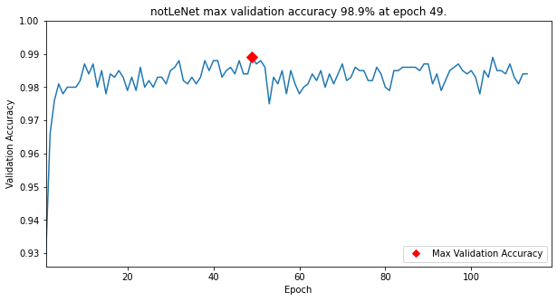
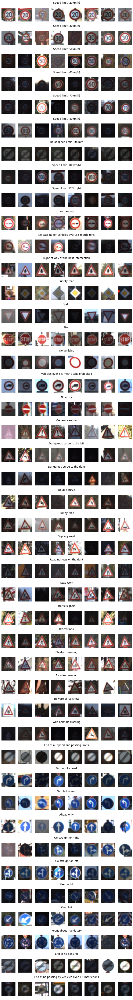
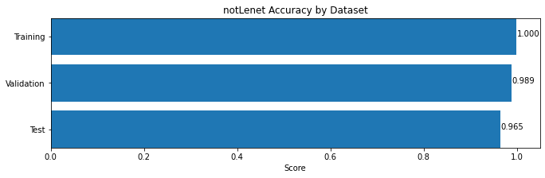
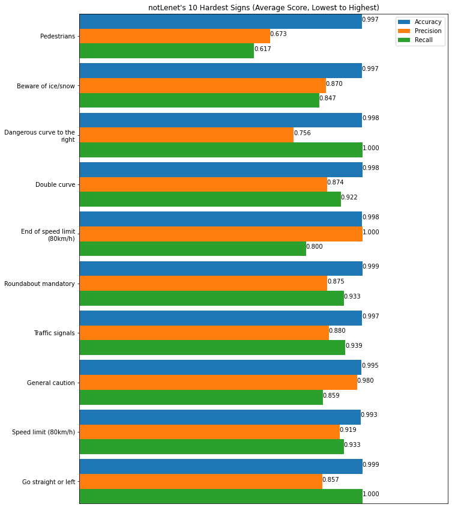
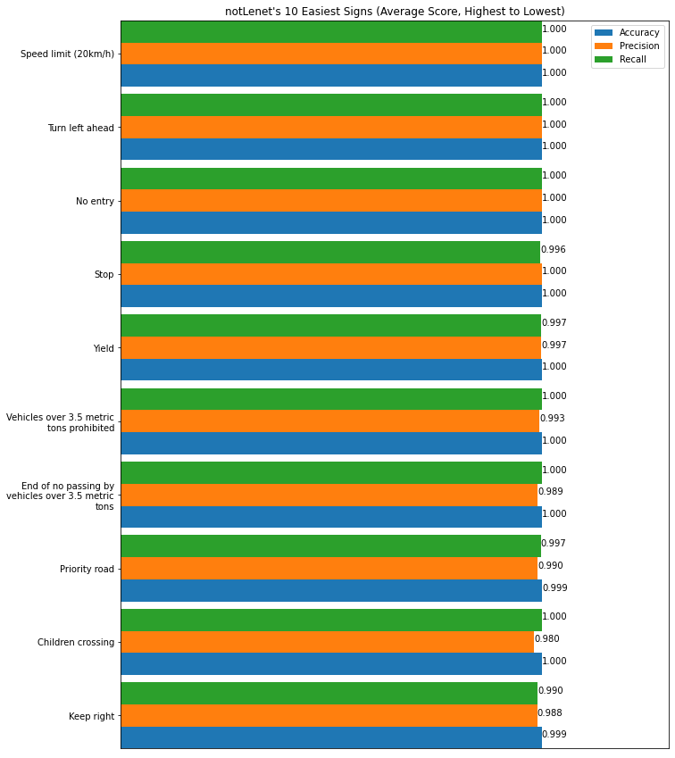
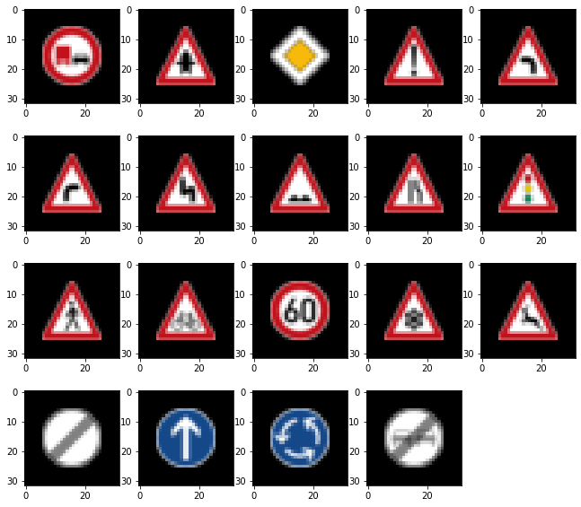
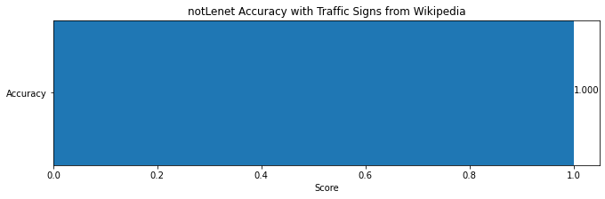
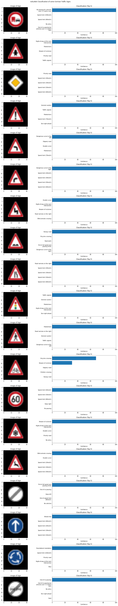
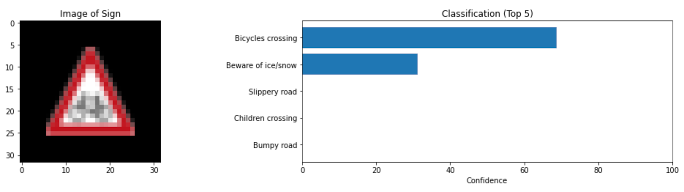

7-FEB-2021
# Traffic Sign Recognition
Implement a convolutional neural network that recognizes traffic signs.



## Goals
- Explore, summarize, and visualize traffic sign data
- Design, train and test a model architecture
- Use the model to make predictions on new images
- Analyze the softmax probabilities of the new images
- Experiment with a Multi-Scale CNN

## Dataset Exploration

The traffic signs are contained in the `data` folder, contained in `train.p`, `valid.p`, and `test.p`. The file `signnames.csv` mapped the class ID number to the name of the type of sign. 

### Data Summary

Loading and examining the data yielded the following characteristics:
- Training Samples: 34,799
- Testing Samples: 12,630
- Image Shape: 32x32x3
- Number of types of Signs: 43


### Data Visualization

Below are some images from each of the 43 types of traffic signs (from the Training Samples). 

Many images are very dark and will need brightness increased. 

Color, shape, and orientation matters for interpretation.



### Sign Type Proportionality

There is a large imbalance in the prorportion of each type of sign found in each dataset (below). 

For example, the proportion of "Speed limit (20km/h)" signs present in the dataset is much less than the proportion of "Speed limit (50km/h)" signs. 

Additional signs will be generated to fix this disproportion so the model has a better chance to be equally exposed to all types of signs during training and hopefully improve validation accuracy.


## Design and Test a Model Architecture

### Preprocessing

Fake images will be generated for the training dataset to address the imbalance in the number of signs for each type of sign. Images will then be brightened then normalized prior to submission for training. 

#### Generating Fake Images

Similar to Sermanet and Lecun in _"Traffic Sign Recognition with Multi-Scale Convolutional Networks"_, shifting, rotation, and scaling (zooming in) is randomly performed on traffic signs generated to augment the dataset. These manipulations will expose the model to different variations of the generated image during training.

```python
def shift(image, d=None):
    '''
    Shifts image left, right, up or down from 1 to 6 pixels. 
    Used in generating additional training samples.
    '''
    if d is None:
        d = random.randint(1, 6)
    direction = random.choice([1, 2, 3, 4])
    if direction == 1:
        image[:-d] = image[d:]
    elif direction == 2:
        image[d:] = image[:-d]
    elif direction == 3:
        image[:,d:] = image[:,:-d]
    else:
        image[:,:-d] = image[:,d:]
        
    return image

def crop(image, size=32):
    '''
    Crops image to 32x32. Used after image is zoomed in.
    '''
    sizes = np.array(image.shape[:2]) - 32
    lower =  sizes // 2
    upper = image.shape[:2] - (lower + (sizes % 2))
    img = image[lower[0]:upper[0], lower[1]:upper[1]]
    return img

def zoom(image, scale=None):
    '''
    Zooms in on an image from 1.0x to 1.6x. Uses crop to ensure img is 32x32
    Used in generating additional training samples.
    '''
    if scale is None:
        scale = random.uniform(1.0, 1.6)
    img = sk.transform.rescale(image, scale, multichannel=True, preserve_range=True).astype(np.uint8)
    return crop(img)

def rotate (image, deg=None):
    '''
    Rotates image from -15 to 15 degrees.
    Used in generating additional training samples.
    '''
    if deg is None:
        deg = random.uniform(-15, 15)
    return sk.transform.rotate(image, deg, preserve_range=True).astype(np.uint8)
```

#### Larger and Balanced Training Set

After adding the fake images, the training set grew from 34,799 to 259,290 samples. This increase in the amount of training data helped push the model to high validation accuracies during experimentation. The fake images were generated in such a way as to achieve a balance in proportion accross each type of traffic sign.


#### Brightening Dark Images

`equalizeHist()` from `opencv` was used to brighten dark images. The image is first converted to the HSV colorspace. Then if the average value of the V-component, `mean_v`, is less than the default `v_thresh` of 128, `equalizeHist()` is applied:

```python
def equalizeHist(orgimg, v_thresh=128):
    '''
    Brightens dark images.
    
    Params:
    - orgimg: original image (RGB)
    - v_thresh: max integer of the average value of the image for brightening to occur
    '''
    hsv = cv2.cvtColor(orgimg, cv2.COLOR_RGB2HSV)
    mean_v = np.mean(hsv[:,:,2])
    if mean_v < v_thresh:
        equ = cv2.equalizeHist(hsv[:,:,2])
        hsv[:,:,2] = equ
        img = cv2.cvtColor(hsv, cv2.COLOR_HSV2RGB)
    else:
        img = orgimg
    return img
```

#### Normalizing Image Data

"A guiding principle in developing the model architecture is for the inputs to have a mean of 0.0 (zero) and have equal variance" (see [Normalized Inputs and Initialization](https://youtu.be/WaHQ9-UXIIg?t=22)). This makes it easier for the Tensorflow optimizer to discover appropriate parameters (weights and biases) during training. The `function RGB_to_norm()` is applied to normalize the images:

```python
def RGB_to_norm(img):
    return (np.float32(img) - 128)/128
```

#### Examples of Processed Image

Below shows the effects of applying brightening, rotation, zoom, and shifting to a sample image:


### Model Architecture

The model architecture generally follows the LeNet architecture outlined in _Lesson 13: Convolutional Neural Networks, Item 36. Lab: LeNet in Tensorflow_.

A 1x1 convolution used in the very first layer has an output shape of 32x32x1. This forces the model to compress the 3 RGB channels of the Input layer into 1 channel, thus achieving a grayscaling effect, but allowing the model to determine the significance of each channel value. The improved validation accuracy was quite astonishing as compared to training the model without this 1x1 convolution in the first layer. 

The other convolutional layers have the same first and second dimensions as LeNet, but are deeper (24 and 64 respectively. The fully connected layers are wider with dropout added in the later stages. The  deepening of the convolutions, widening of the connections, and addition of dropout seemed to improve validation accuracy during experimentation.

A custom set of high level classes (`Layers`, `Conv2D`, `Pooling`, `Flatten`, `Connected`, `Dropout`, `Model`, `Sequential`) which wrap `tensorflow` are used to help code the model, named `notLenet`, in a Keras-like fashion.

```python
notLenet = Sequential("notLeNet", input_shape=image_shape, n_classes=n_classes)

notLenet.addLayer (Conv2D   ([32, 32, 1]))
notLenet.addLayer (Conv2D   ([28, 28, 24]))
notLenet.addLayer (Pooling  ([14, 14]))
notLenet.addLayer (Conv2D   ([10, 10, 64]))
notLenet.addLayer (Pooling  ([5, 5]))
notLenet.addLayer (Flatten  ())
notLenet.addLayer (Connected([240]))
notLenet.addLayer (Dropout  ())    
notLenet.addLayer (Connected([168]))
notLenet.addLayer (Dropout  ())

notLenet.assemble()
```

The model summary verified the output shapes of each layer of the model:
```
Model-2944 |      Summary for notLeNet:
Model-2944 | ----------------------------------
Model-2944 |      Input     :(?, 32, 32, 3)
Model-2944 | ----------------------------------
Model-2944 | 0  : Conv2D    :(?, 32, 32, 1)
Model-2944 | 1  : Conv2D    :(?, 28, 28, 24)
Model-2944 | 2  : Pooling   :(?, 14, 14, 24)
Model-2944 | 3  : Conv2D    :(?, 10, 10, 64)
Model-2944 | 4  : Pooling   :(?, 5, 5, 64)
Model-2944 | 5  : Flatten   :(?, 1600)
Model-2944 | 6  : Connected :(?, 240)
Model-2944 | 7  : Dropout   :(?, 240)
Model-2944 | 8  : Connected :(?, 168)
Model-2944 | 9  : Dropout   :(?, 168)
Model-2944 | ----------------------------------
Model-2944 |      Logits    :(?, 43)
Model-2944 | ----------------------------------
```

### Model Training

In `Model.connectLogits(),` the output logits and one-hot encoded labels were fed to Tensorflow's `tf.nn.softmax_cross_entropy_with_logits` to caculate the losses for each training batch. 

In `Model.train()`, the mean of this loss was fed to `tf.train.AdamOptimizer` which created the `minimizer` operation for use in `tf.Session.run()`. 


```python
def connectLogits(self, prev_layer):

    self.logits = connected(prev_layer.tensor, [self.n_classes], activation=None)

    oh_labels      = tf.one_hot(self.y, self.n_classes)
    losses         = tf.nn.softmax_cross_entropy_with_logits(labels=oh_labels, logits=self.logits)
    self.mean_loss = tf.reduce_mean(losses)
    #...etc...
    return

def train(self, training_data, validation_data, epochs_done, batch_size, lr=0.001, 
          acc_save=0.93, acc_done=0.982, keep_prob=1.0, ):

    #...etc...
    optimizer = tf.train.AdamOptimizer(learning_rate=lr)
    minimizer = optimizer.minimize(self.mean_loss)
    #...etc...
    with tf.Session() as sess:
        #...etc...
        for offset in range(0, num_examples, batch_size):
            #...etc...
            sess.run(minimizer, feed_dict=feed_dict)
```

A batch size of `batch_size=128` was chosen through trial and error. Training terminates once `epochs_done=64` epochs have passed since last highest validation accuracy was detected. If validation accuracy reaches `acc_done=0.997` (which it doesn't), training will also terminate. the model is saved every time a new high accuracy is achieved. Keep probability for the dropout layers is `keep_prob=0.5`.

```python
notLenet.train(trainingSigns.data(), validSigns.data(), batch_size=128, 
        epochs_done=64, acc_done=0.997, keep_prob=0.5)
```

### Solution Approach

The `Model.measure()` method is used to calculate validation accuracy after each epoch of training using Tensorflow's `tf.metrics.accuracy`. Note the accuracy is rounded to the third decimal:

 ```python
acc = round (self.measure([tf.metrics.accuracy], validation_data)[0], 3)
```

`Model.measure()` use as list of Tensorflow metrics, `tf_metrics` parameter, to calculate the desired metrics. In the case of calculating accuracy during training:

```python
tf_metrics = [tf.metrics.accuracy]
```

The `labels` and `predictions` for the accuracy operation simply uses the `tf.argmax()` of the one-hot encoded labels and logits respectively:

```python
labels      = tf.argmax(self.oh_labels, 1)
predictions = tf.argmax(self.logits, 1)
```

The respective Tensorflow metrics operations (in this case `tf_metrics=[tf.metrics.accuracy]` are then created with:

```python
for i, tf_metric in enumerate(tf_metrics):
    # setup tensorflow metrics precision tensor
    name = 'metric_' + str(i)
    op_metric, op_upd_metric = tf_metric(labels, predictions, name=name)
```

The update metric operation, `op_upd_metric`, is then used successively for each batch of validation data:

```python
for offset in range(0, n_samples, batch_size):

    #...etc...
    for op_upd_metric in op_upd_metrics:
        sess.run(op_upd_metric, feed_dict=feed_dict)
```

The score of the metric is obtained by running `op_metric` once all batches are processed:

```python
scores = [sess.run(op_metric) for op_metric in op_metrics]
```

### notLenet Performance


#### Validation Accuracy

Training will continue as long as `epochs_done=64` epochs have not elapsed since the last highest accuracy score. notLenet's highest validation accuracy was __98.9%__ at epoch 49. The entire validation accuracy history is shown below:


#### Accuracy Across All Datasets

Accuracy across all datasets is plotted below:



#### By-Class Perfomance with Test Data Set

By-class metrics can also be computed if a `classId` is passed to the `Model.measure()` method. In this case, the model is made to predict if input image is or is not the sign associated with `classId`, instead of predicting the actual `classId` number. The labels and predictions are thus set like below:

```python
tf_classId  = tf.constant(classId, tf.int64)
labels      = tf.equal(tf.argmax(self.oh_labels, 1), tf_classId)
predictions = tf.equal(tf.argmax(self.logits, 1), tf_classId)
```

Additional performance metrics on the Testing Data is calculated (by type of traffic sign) with the `Model.metrics_by_class()` method:

```python
accuracy, precision, recall = notLenet.metrics_by_class(testSigns.data())
```

##### Hardest Signs

Averaging each of the `accuracy`, `precision`, and `recall` scores, the most difficult signs for notLenet to recognize can then be plotted:



##### Easiest signs

The most easiest signs for notLenet to recognize are plotted as well:



## Test a Model on New Images

### Acquiring New Images

Wikipedia images of German signs were used due to ease of access. Unlike the dataset where the traffic signs appear to be photographs, the aquired signs are graphics. 

The symbols, colors, and shapes appear clearly so the model should be able to classify them easily. 

However, the model has never seen grahics of the signs. The signs also had to be downsized to a lower resolution of 32x32 for the model to use.



### Performance on New Images

As expected, notLenet was able to accurately (100%) classify all Wikipedia traffic signs. While the signs were graphics which the model has never seen, the clear symbols, colors, and shapes probably allowed the model to more easily classify the signs.

```python
notLenet_acc = notLenet.metrics(wiki_traffic_signs.data(), metrics=[tf.metrics.accuracy])[0]
vwr.barhScores("notLenet Accuracy with Traffic Signs from Wikipedia", [notLenet_acc], ["Accuracy"])
```



Compare to the Testing data, the model was only able to achieve a 96.5% accuracy.


### Model Certainty - Softmax Probabilities

Below are visualizations of the model's top-5 classifications for each of the wikipedia signs. The model for the most part was very certain (100%) for each of the classification. 



### A Closer Look at Bicycles Crossing Sign Classification

The model was only 70% confident in the classification of "Bicycles Crossing". It was 30% confident that it was a sign for "Beware of Ice and Snow". This may be explained by the fact that "Beware of Ice and Snow" is the #2 Hardest Sign for the model to recognize (see [Hardest Signs](#hardest-signs)). Since the precision for "Beware of Ice and Snow is 87%", this may be a tendency towards a false positive identication of the Bicycle Crossing sign as "Beware of Ice and Snow".




